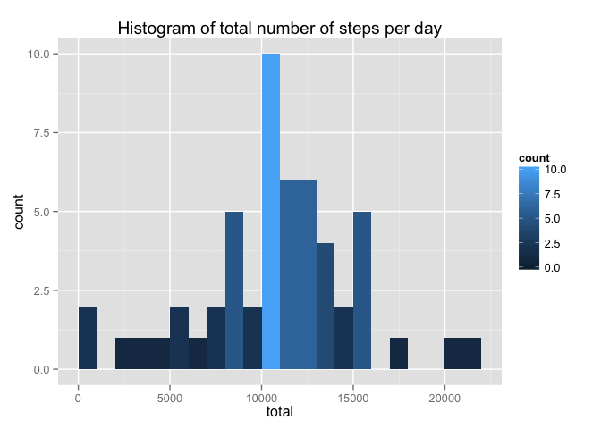
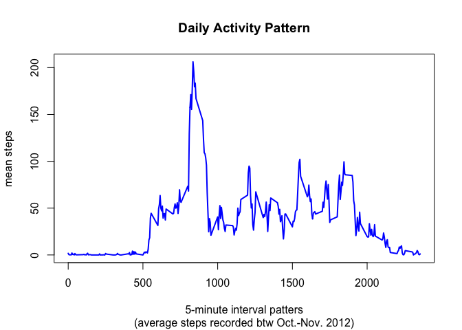
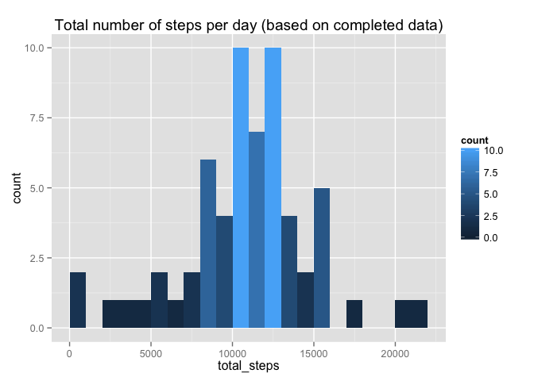
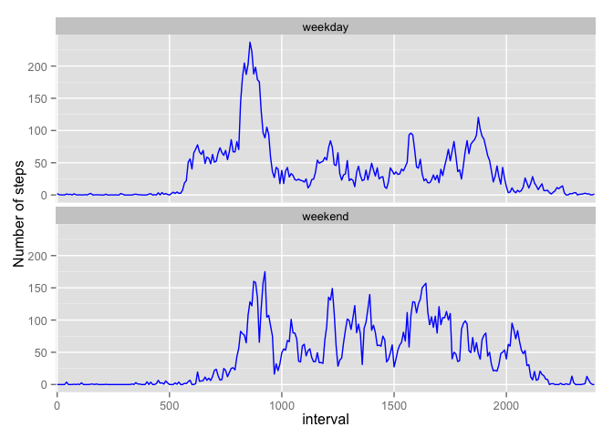

# Reproducible Research: Peer Assessment 1

## Introduction

The following document combines the output for the Coursera class ["Reproducible Research"] [1] [Peer Assessment 1] [2] and showcases the principls, tools and results of literate statistics within a RMarkdown document. In general the grey boxes denote the R Code and the white boxes the corresponding output / results.

### Data & Objectives

This assignment makes use of data from a personal activity monitoring device. This device collects data at 5 minute intervals throughout the day. The data consists of two months of data from an anonymous individual collected during the months of October and November, 2012 and include the number of steps taken in 5 minute intervals each day.

The relevant variables used for the subsequent analysis are as follows:

* **Steps** Number of steps taken in a 5-minute interval (missing values are coded as NA)
* **Date** Date on which the measurement was taken in YYYY-MM-DD format
* **Interval** Identifier for the 5-minute interval in which measurement was taken

**Objectives**

The following questions have to be answered within this report:

1. What is the total number of steps taken per day?
2. What is the average daily activity pattern?
3. Are there differences in the activity patterns between weekdays and weekends?

***

## Loading and preprocessing the data

As a first step the environment to process the data will be prepared. This includes setting the correct working directory, loading all of the relevant depedencies & libraries and setting the relevant defaults for later knitr processing:


```r
setwd("~/Documents/workspace/RStudio/Training/RepData_PA1")

library(knitr)        ## used to weave the final RMD document
library(plyr)         ## Required for data transformations
library(dplyr)        ## structuring the data for analysis
```

```
## 
## Attaching package: 'dplyr'
## 
## Die folgenden Objekte sind maskiert von 'package:plyr':
## 
##     arrange, count, desc, failwith, id, mutate, rename, summarise,
##     summarize
## 
## Die folgenden Objekte sind maskiert von 'package:stats':
## 
##     filter, lag
## 
## Die folgenden Objekte sind maskiert von 'package:base':
## 
##     intersect, setdiff, setequal, union
```

```r
library(ggplot2)      ## used for more sophisticated plots

options(scipen = 999)   
opts_chunk$set(echo = TRUE, results = 'hold', tidy = TRUE, ident='  ')
```

I order to load the data we first evaluate whether the activity ZIP-file is available and if not, load it from the link mwetioned in the assessment instructions:


```r
read_data <- function() {
    file_name = "activity.zip"
    Url = "https://d396qusza40orc.cloudfront.net/repdata%2Fdata%2Factivity.zip"
    if (!file.exists(file_name)) {
        download.file(Url, destfile = file_name)
    }
    csv_file <- unz(file_name, "activity.csv")
    act_raw <- read.csv(csv_file, header = T, colClasses = c("numeric", "character", 
        "numeric"))
    act_raw$interval <- factor(act_raw$interval)
    act_raw$date <- as.Date(act_raw$date, format = "%Y-%m-%d")
    act_raw
}
act_raw <- suppressWarnings(read_data())
```

***

## What is mean total number of steps taken per day?

For this part of the assignment the missing values (NA) in the dataset are ignored.

1. Make a histogram of the total number of steps taken each day
2. Calculate and report the **mean** and **median** total number of steps taken per day


```r
steps_p_day <- act_raw %>% group_by(date) %>% summarise(total = sum(steps, na.rm = T))

ggplot(steps_p_day, aes(x = total)) + geom_histogram(aes(fill = ..count..), 
    origin = 0.1, binwidth = 1000) + ggtitle("Histogram of total number of steps per day")
```

 

```r
steps_p_day[steps_p_day == 0] <- NA

steps_total <- function(x) {
    funs <- c(mean = mean, median = median)
    lapply(funs, function(f) f(x, na.rm = T))
}
steps_total(steps_p_day$total)
```

```
## $mean
## [1] 10766.19
## 
## $median
## [1] 10765
```

Hence the **median** is 10765 and the **mean** is 10766.19.

***

## What is the average daily activity pattern?

In order to answer this question we process the following steps:

1. Create a factor of the interval (time of day) to aggregate based on it
2. Calculate average number of steps for each interval using **group_by** and **summarise** functions
3. Plot the time series 5-minute intervals *(x-axis)* and the average number of steps, averaged across all days *(y-axis)*
4. Find the intervall that contains the maximum number of steps


```r
act_raw$int_fact <- as.factor(act_raw$interval)

act_int <- act_raw %>% group_by(int_fact) %>% summarise(mean_steps = mean(steps, 
    na.rm = TRUE))

act_int$interval <- as.numeric(as.character(act_int$int_fact))
plot(act_int$interval, act_int$mean_steps, type = "l", col = "blue", lwd = 2, 
    xlab = "5-minute interval patters", ylab = "mean steps", main = "Daily Activity Pattern", 
    sub = "(average steps recorded btw Oct.-Nov. 2012)")
```

 

```r
act_int[which.max(act_int$mean_steps), ]
```

```
## Source: local data frame [1 x 3]
## 
##   int_fact mean_steps interval
## 1      835   206.1698      835
```

As gathered from above output we can see, that the **835th interval** contains the maximum, an average of **206 steps**.

***

## Imputing missing values

As the inclusion of missing values (NAs) introduces bias into various measures a pre-process is required to mitigate such a bias:

1. Calculate and report the total number of missing values in the dataset (i.e. total number of rows with NAs). 
2. Devise a strategy for filling in all of the missing values in the dataset (i.e. replace missing values with a suitable substitute like means or median) to obtain a new dataset without NAs.
3. Plot a histogram of the total number of steps taken each day and calculate and report the **mean** and **median** total number of steps taken per day. 
4. Do these values differ from the estimates from the first part of the assignment? 
5. What is the impact of imputing missing data on the estimates of the total daily number of steps?


```r
act_raw$weekday <- weekdays(as.Date(act_raw$date))

NA_days <- act_raw %>% group_by(weekday) %>% summarise(sum(is.na(steps)))

print(NA_days)

act_day <- act_raw %>% group_by(weekday, interval) %>% summarise(mean_steps = mean(steps, 
    na.rm = TRUE))

act_compl <- merge(act_raw, act_day, by = c("weekday", "interval"))

act_compl$compl_steps <- ifelse(is.na(act_compl$steps), act_compl$mean_steps, 
    act_compl$steps)

act_compl_mean <- act_compl %>% group_by(date) %>% summarise(total_steps = sum(compl_steps))


ggplot(act_compl_mean, aes(x = total_steps)) + geom_histogram(aes(fill = ..count..), 
    origin = 0.1, binwidth = 1000) + ggtitle("Total number of steps per day (based on completed data)")
```

 

```
## Source: local data frame [7 x 2]
## 
##      weekday sum(is.na(steps))
## 1   Dienstag                 0
## 2 Donnerstag               288
## 3    Freitag               576
## 4   Mittwoch               288
## 5     Montag               576
## 6    Samstag               288
## 7    Sonntag               288
```

Based on above pre-processing code the answers to above questions are as follows:

1. The total number of rows with missing values is **2304**.
2. Chose **mean** - see code block above
3. See plot above. The mean number of steps per day are **10821.2096019** and the median are **11015**
4. Yes, the values differ in absolute numbers but not in structure. This indicates a valid imputing strategy as it does not change the overall results.
5. Compared side by side it becomes obvious that the completed data has __increased__ the absolute number of steps.

original data          | completed data
-----------------------|------------------------
570608 | 660094


***

## Are there differences in activity patterns between weekdays and weekends?

For this section of the assignment the completed data set is to be used.


```r
act_compl_weekend <- act_compl %>% mutate(weekday = strftime(act_compl$date, 
    format = "%u"))

act_compl_weekend$day_type <- mapvalues(act_compl_weekend$weekday, c(1:7), c("weekday", 
    "weekday", "weekday", "weekday", "weekday", "weekend", "weekend"))

act_weekdays <- subset(act_compl_weekend, day_type == "weekday")
act_weekends <- subset(act_compl_weekend, day_type == "weekend")

act_wd_avg <- aggregate(act_weekdays$mean_steps, list(act_weekdays$interval, 
    act_weekdays$day_type), mean)
act_we_avg <- aggregate(act_weekends$mean_steps, list(act_weekends$interval, 
    act_weekends$day_type), mean)

colnames(act_wd_avg) <- c("interval", "day_type", "avg_steps")
colnames(act_we_avg) <- c("interval", "day_type", "avg_steps")

act_wd_we <- rbind(act_wd_avg, act_we_avg)

ggplot(act_wd_we, aes(x = interval, y = avg_steps, group = 1)) + geom_line(col = "blue") + 
    scale_x_discrete(breaks = seq(0, 2500, 500)) + facet_wrap(~day_type, nrow = 2) + 
    ylab("Number of steps")
```

 

### Conclusion on patterns

As the two plots show the __weekday pattern__ shows one single peak above 200 steps but subsequently has a lower activity spread across all intervals.

The __weekend pattern__ shows a loweer absolute peak but also shows an overall higher level of steps throughout the remainder of the intervalls. One possible conclusion would be that the weekend activities are closely correlated with more steps.

***

[1]: https://class.coursera.org/repdata-032/ "Coursera Class on Reproducible Research"
[2]: https://class.coursera.org/repdata-032/human_grading/view/courses/975145/assessments/3/submissions "Peer Assessment 1"
[3]: https://d396qusza40orc.cloudfront.net/repdata%2Fdata%2Factivity.zip "Peer Assessment Activity Data ZIP"

